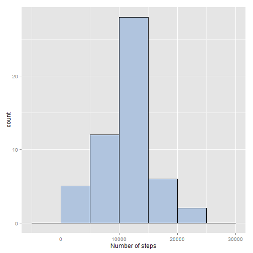
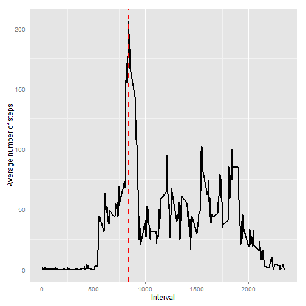
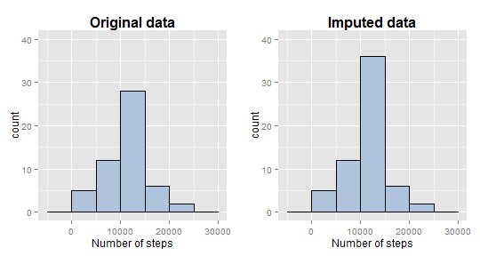
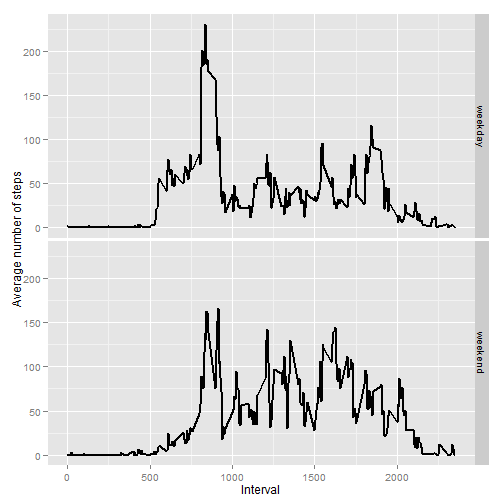

```r
# load needed libraries
library(dplyr)
library(ggplot2)
library(gridExtra)
library(lubridate)
```
## Loading and preprocessing the data


```r
setwd("Z:/Shared Docs/Courses/Coursera/DSS5 - Reproducible Research/projects/PA1")

if(!file.exists("activity.csv")){
    # download data if necessary
    zipfile = "repdata-data-activity.zip"
    if(!file.exists(zipfile)){
        url <- "https://d396qusza40orc.cloudfront.net/repdata%2Fdata%2Factivity.zip"
        download.file(url, zipfile)
    }
    # Decompress the file
    unzip(zipfile, exdir = ".")
}

activity.raw <- read.csv("activity.csv", stringsAsFactors=FALSE)
activity.raw$date <- as.Date(activity.raw$date, "%Y-%m-%d")

str(activity.raw)
```

```
## 'data.frame':	17568 obs. of  3 variables:
##  $ steps   : int  NA NA NA NA NA NA NA NA NA NA ...
##  $ date    : Date, format: "2012-10-01" "2012-10-01" ...
##  $ interval: int  0 5 10 15 20 25 30 35 40 45 ...
```

## What is mean total number of steps taken per day?


```r
# create daily data set with total steps per day 
activity.daily <- activity.raw %>%
    group_by(date) %>%
    summarize(steps=sum(steps))

# histogram of total number of steps taken each day
plt1 <- ggplot(activity.daily, aes(x=steps))  
plt1 <- plt1 + geom_histogram(binwidth=5000, color="black", fill="lightsteelblue")
# plt1 <- plt1 + ggtitle("Total number of steps taken each day") + 
#     theme(plot.title=element_text(face="bold", size=16)) 
plt1 <- plt1 + xlab("Number of steps")  
plt1
```

 

####The mean of the total number of steps taken per day is


```r
steps.mean <- mean(activity.daily$steps, na.rm = TRUE)
steps.mean
```

```
## [1] 10766.19
```

####The median of the total number of steps taken per day is


```r
steps.median <- median(activity.daily$steps, na.rm = TRUE)
steps.median
```

```
## [1] 10765
```

## What is the average daily activity pattern?


```r
# create data set with total steps per time interval 
activity.time <- activity.raw %>%
    group_by(interval) %>%
    summarize(steps=mean(steps, na.rm=TRUE))

int_max <- activity.time$interval[which.max(activity.time$steps)]

plt2 <- ggplot(activity.time, aes(x=interval, y=steps))
plt2 <- plt2 + geom_line(size=1, color="black")
plt2 <- plt2 +  geom_vline(aes(xintercept=int_max), size=1, colour="red", 
                           linetype="dashed")
# plt2 <- plt2 + ggtitle("Number of steps taken averaged across all days") +
#     theme(plot.title=element_text(face="bold", size=16))
plt2 <- plt2 + ylab("Average number of steps") + xlab("Interval") 
plt2
```

 

####The interval that contains the maximum number of steps, on average across all the days, is  


```r
int_max
```

```
## [1] 835
```

## Imputing missing values
####The total number of missing values in the dataset is


```r
# Count the number of rows with NAs
nmiss <- sum(is.na(activity.raw$steps))
nmiss
```

```
## [1] 2304
```

```r
# missing value imputation using the interval mean value
activity.imputed <- activity.raw %>%
    group_by(interval) %>%
    mutate(steps = ifelse(is.na(steps), mean(steps, na.rm=TRUE), steps))

activity.imputed.daily <- activity.imputed %>%
    group_by(date) %>%
    summarize(steps = sum(steps))

# compare distribution before and after imputation
plt3 <- ggplot(activity.daily, aes(x=steps)) + ylim(0, 40)
plt3 <- plt3 + geom_histogram(binwidth=5000, color="black", fill="lightsteelblue")
plt3 <- plt3 + ggtitle("Original data") + 
    theme(plot.title=element_text(face="bold", size=16)) 
plt3 <- plt3 + xlab("Number of steps")  

plt4 <- ggplot(activity.imputed.daily, aes(x=steps)) + ylim(0, 40)
plt4 <- plt4 + geom_histogram(binwidth=5000, color="black", fill="lightsteelblue")
plt4 <- plt4 + ggtitle("Imputed data") + 
    theme(plot.title=element_text(face="bold", size=16)) 
plt4 <- plt4 + xlab("Number of steps")

grid.arrange(plt3, plt4, ncol=2)
```

 

####The mean of the total number of steps taken per day after missing imputation is 


```r
steps.impmean <- mean(activity.imputed.daily$steps)
steps.impmean
```

```
## [1] 10766.19
```

####The median of the total number of steps taken per day after missing imputation is 


```r
steps.impmedian <- mean(activity.imputed.daily$steps)
steps.impmedian
```

```
## [1] 10766.19
```

**The values are now equal.**      

The impact of imputing missing data is to increase the frequency of the central part of the distribution.

## Are there differences in activity patterns between weekdays and weekends?


```r
# Add new factor variable indicating whether a given date 
# is a weekday or weekend day
get.daytype <- function(date) { # wday returns Sunday=1 and Saturday=7
    type <- ifelse(wday(date) %in% c(1, 7), "weekend", "weekday")
}

activity.imputed$daytype <- get.daytype(activity.imputed$date)
activity.imputed$daytype <- as.factor(activity.imputed$daytype)

activity.imputed.time <- activity.imputed %>%
    group_by(daytype, interval) %>%
    summarize(steps=mean(steps))

plt5 <- ggplot(activity.imputed.time, aes(x=interval, y=steps))
plt5 <- plt5 + geom_line(size=1, color="black")
# plt5 <- plt5 + ggtitle("Number of steps taken averaged across all days") +
#     theme(plot.title=element_text(face="bold", size=16))
plt5 <- plt5 + ylab("Average number of steps") + xlab("Interval")
plt5 + facet_grid(daytype ~ .)
```

 

